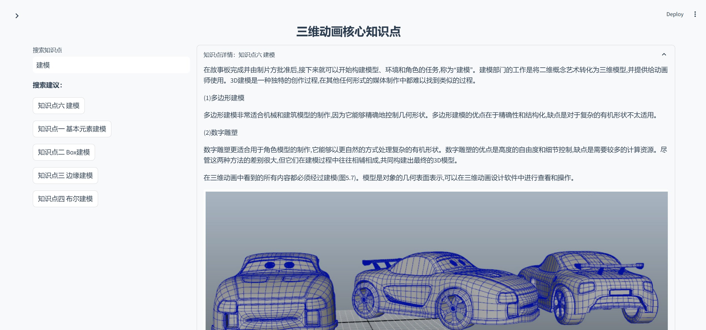

# 一个基于RAG的学习支持系统（项目以三维动画为例）

## 项目简介

基于RAG（检索增强生成）架构的知识问答平台，通过向量数据库存储和检索专业知识，结合大语言模型的生成能力，为用户提供准确、专业的问答服务，并自动生成知识图谱，帮助用户更好地理解相关概念和关系。




## 核心组件

- 向量数据库：Milvus 2.3.3 (支持GPU加速)
- 大语言模型：Qwen2.5 7B (通过Ollama本地部署)
- 前端框架：Streamlit 1.40.2
- 向量嵌入：BAAI/bge-large-zh-v1.5
- 深度学习框架：PyTorch 2.3.1 (CUDA 11.8)
- 知识图谱可视化：Pyvis
- 容器化：Docker & Docker Compose

## 环境要求

- Python 3.8+
- CUDA 11.8
- NVIDIA GPU (建议)
- Docker & Docker Compose
- Ollama

## 快速开始

### 1. 环境准备

```bash
# 创建虚拟环境
conda create -n swdhrag python=3.10
conda activate swdhrag

# 安装PyTorch (CUDA 11.8)
pip3 install torch==2.3.1+cu118 torchvision==0.18.1+cu118 torchaudio==2.3.1+cu118 --index-url https://download.pytorch.org/whl/cu118

# 安装项目依赖
pip install -r requirements.txt

# 安装Ollama (从https://ollama.ai下载)
# 拉取所需模型
ollama pull qwen2.5:7b
```

### 2. 配置环境变量

创建 `.env` 文件并配置：

```env
MILVUS_ENDPOINT=localhost:19530
MILVUS_TOKEN=root:123456
COLLECTION_NAME=your_collection_name
```

### 3. 启动 Milvus服务

```bash
# 启动所有服务
docker-compose up -d

# 检查服务状态
docker-compose ps
```

### 4. 导入知识库数据

```bash
# 插入milvus向量数据库
python insert.py
```

### 5. 启动应用

```bash
# 启动streamlit客户端
streamlit run home.py

访问 http://localhost:8501 即可使用系统
```

## 项目结构

```
├── home.py             # 主应用程序入口
├── ask_llm.py          # LLM调用接口和知识图谱提取
├── encoder.py          # 文本向量化模块
├── insert.py           # 数据导入脚本
├── milvus_utils.py     # Milvus工具函数
├── docker-compose.yml  # Docker配置文件
├── .env                # 环境变量配置
├── requirements.txt    # 项目依赖
├── static/             # 静态资源文件
│   └── styles.css      # 自定义样式
├── pics/               # 图片资源
├── images/             # 知识库图片
├── wz.md               # 知识库内容
└── index.md            # 知识库内容索引
```
## 注意事项

1. 确保 Ollama 服务正常运行（默认端口：11434）
2. 检查 Milvus 服务状态（默认端口：19530）
3. 确保足够的磁盘空间（建议 2GB+）
4. 确保 NVIDIA 驱动和 CUDA 11.8 正确安装
5. 首次运行时需要等待向量数据库初始化完成

## 许可证

本项目采用MIT许可证 - 详情请参阅LICENSE文件